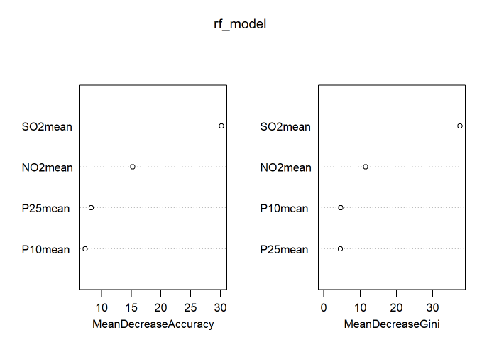
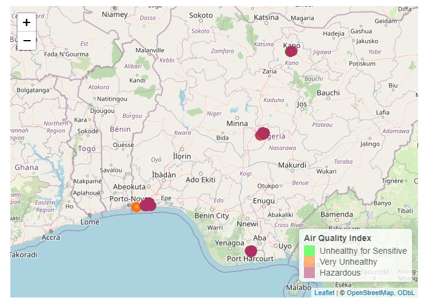

# 🌍 Advanced Air Quality Analysis Using Lichen Genus Data

---

## 📌 Project Overview

This end-to-end data science project demonstrates advanced skills in environmental data analysis using **lichen genus data** as sensitive bioindicators of air quality. Lichens are highly effective natural monitors of atmospheric pollution, particularly for particulate matter (PM2.5, PM10), nitrogen dioxide (NO₂), and sulfur dioxide (SO₂).

The analysis combines multivariate statistics, unsupervised clustering, machine learning classification, dimensionality reduction, and interactive geospatial mapping to identify pollution gradients, air quality zones, and high-risk hotspots. 

**Professional Data Processing • Advanced Statistical Modeling • Machine Learning • Interactive Geospatial Visualization**

This project analyzes lichen genus distribution alongside pollutant concentrations to uncover spatial pollution patterns and support evidence-based environmental decision-making.

---

## 🎯 Objectives

- Clean and preprocess lichen genus and air pollutant data for analysis
- Perform exploratory data analysis and correlation studies
- Apply Principal Component Analysis (PCA) for dimensionality reduction
- Identify distinct air quality zones using K-means clustering
- Build and evaluate machine learning models (Random Forest & XGBoost) for AQI classification
- Create interactive geographic maps to visualize pollution hotspots and clean zones
- Derive actionable insights and policy recommendations for targeted intervention

---

## 🛠️ Tools & Technologies

- **R** & **R Markdown** (for reproducible reporting)
- **tidyverse** – Data manipulation and visualization
- **factoextra** & **cluster** – PCA and clustering analysis
- **randomForest** & **xgboost** – Machine learning classification
- **caret** – Model performance evaluation
- **corrplot** – Correlation visualization
- **leaflet** – Interactive mapping
- **scales** – Color and formatting support

---

## 📸 Sample Visualizations

* **Random Forest Model**

* **Geographic Mapping (Air Quality Visualization**

*(Best viewed on desktop – full interactive version and all plots available in the HTML report)*

---

## 📈 View the Full Report

👉 **[Open Interactive HTML Report](https://shane-20.github.io/air-quality-analysis-project/air_quality_analysis_project.html)**

*(Best viewed on desktop – contains all interactive visualizations, Leaflet map, model outputs, and detailed insights)*

---

## 🧠 Skills Demonstrated

- Advanced handling and cleaning of environmental bioindicator data
- Multivariate analysis (PCA) and unsupervised clustering (K-means)
- Supervised machine learning for multi-class AQI prediction (Random Forest & XGBoost)
- Feature importance analysis and model evaluation
- Interactive geospatial visualization with Leaflet
- Reproducible research and clear scientific communication
- Deriving policy-relevant insights from complex environmental data

---

## 📊 Key Insights

- Distinct **air quality zones** were identified, showing spatially structured pollution patterns rather than uniform distribution.
- **Particulate matter (PM2.5 and PM10)** are the dominant drivers of air quality degradation.
- High-pollution hotspots, moderate transition zones, and relatively clean areas were clearly differentiated.
- Machine learning models achieved strong predictive performance for AQI category classification.
- Pollution is geographically concentrated, pointing to localized sources such as traffic or industrial activities.

---

## 📌 Recommendations

- Prioritize urgent emission controls in high-pollution hotspots
- Implement preventive strategies in moderate-risk transition zones
- Protect low-pollution areas through conservation and sustainable planning
- Target reduction efforts specifically on particulate matter (PM2.5 & PM10)
- Adopt spatially targeted, cluster-specific environmental policies
- Integrate lichen-based biomonitoring into routine air quality programs
- Use Random Forest and XGBoost models for ongoing predictive monitoring

---

## 📂 Dataset

- **Dataset**: `Air_quality_lichen_genus_data.csv`
- **Key Variables**: Lichen genera, PM2.5, PM10, NO₂, SO₂ concentrations, Calculated AQI, Geographic coordinates (Latitude & Longitude)
- **Focus**: Lichen genus distribution as a proxy for air quality assessment
- **Source**: Kaggle  

---

## 📬 Contact

**Ajik Shadrach**  
ajikshane@gmail.com

---
